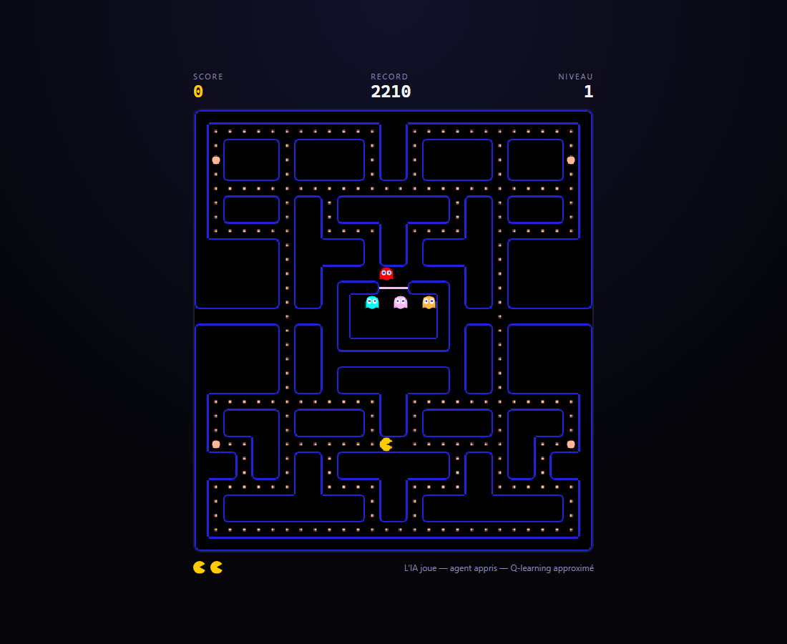

# Pac-Man : un terrain de mesure pour l'intelligence artificielle

Projet libre d'Intelligence Artificielle, Master 1 (module IA_PO, 2025-2026).

**Le problème.** Comparer des approches d'IA demande un terrain qui ne triche
pas : reproductible, rapide, et dont on connaît les règles exactes. Les
environnements tout faits sont des boîtes noires : on y mesure un agent sans
jamais pouvoir expliquer ce que l'environnement lui a fait. Ce projet
construit donc le terrain **et** les agents, et les mesure ensemble.

**Ce que ça donne.** Un Pac-Man complet et jouable, et quatre familles d'IA qui
s'y affrontent sur les mêmes graines :

| | Approche | Où |
|---|---|---|
| Les 4 fantômes | règles écrites à la main, fidèles à l'arcade de 1980 | `ai/` |
| Le joueur heuristique | règles écrites à la main, sert de plafond | `rl/agents.py` |
| Le joueur apprenant | **Q-learning approximé** sur des descripteurs bornés | `rl/` |
| Le joueur chercheur | **simulation en avant**, aucun entraînement | `rl/search.py` |

**Public visé.** Qui veut voir un agent apprendre sur un problème qu'il
comprend entièrement : enseignement, démonstration, base de comparaison. Le
jeu est jouable par n'importe qui dans un navigateur, ce qui rend le
comportement de l'IA lisible sans lire une ligne de code.

Le partage est net : le back-end simule, le front affiche. Le client ne
contient aucune règle du jeu : il envoie des intentions et dessine l'état
que le serveur lui diffuse.

**Où est l'IA dans le dépôt.** En lignes de Python, les modules d'intelligence
artificielle, `ai/` (les fantômes), `rl/` (agents, environnement, protocole
d'évaluation) et les quatre scripts de mesure, pèsent **47 % du code** ;
36 % si l'on compte le client web en JavaScript. Le reste est le moteur et
l'API, qui n'ont pas été écrits pour eux-mêmes mais **comme banc d'essai** :
déterministes, clonables, sans horloge : trois propriétés dont aucun agent ne
peut se passer et que les tests gardent en premier. Le chiffre se recalcule
avec `wc -l` sur ces dossiers ; il n'est pas plus flatteur que ça.

> **Usage de l'IA générative** : ce projet a été développé avec Claude Code.
> Le détail complet est en fin de README, section [Usage IA](#usage-ia).

## Voir l'IA jouer

### En direct, dans le jeu

Une fois le projet installé (deux minutes, section suivante) :

```bash
pacman-server
```

puis ouvrir **http://127.0.0.1:8000/?ia=appris** : la partie démarre toute
seule. Le serveur fait jouer le **modèle final** : l'agent appris du comparatif,
dont les poids sont embarqués dans le paquet, et le navigateur affiche la
partie comme pour un joueur humain. Les touches de direction sont ignorées ;
`Espace` met en pause. L'écran d'accueil du jeu (http://127.0.0.1:8000)
propose aussi les trois autres agents : `?ia=recherche`, `?ia=heuristique`,
`?ia=aleatoire`.



*Si le serveur tournait déjà avant une mise à jour du dépôt, le navigateur peut
garder l'ancien client en cache : `Ctrl+F5` sur la page le recharge.*

L'agent que l'on regarde est **exactement celui qui a été mesuré** : le pilote
côté serveur reprend la discipline de l'environnement d'entraînement (décider
aux intersections, suivre le couloir entre deux), et un test compare les deux
trajectoires case par case (`tests/test_pilot.py`). Son score n'entre pas dans
le classement des joueurs.

Pour le comparer aux autres agents en chiffres plutôt qu'à l'œil :

```bash
pacman-rl compare --ghosts 4 --games 30 --weights results/poids_4fantomes.json
```

### Sans rien installer

[`docs/decisions.html`](docs/decisions.html) est une page **autonome, déjà
générée** : elle rejoue une partie complète de l'agent appris, image par image,
et montre à chaque intersection ce qu'il a envisagé, ce que chaque direction
valait, et pourquoi il a choisi celle-là.

GitHub affiche le *code* d'un fichier HTML, pas la page : cliquer sur le lien
ci-dessus, puis sur **« Download raw file »** (icône de téléchargement, en haut
à droite), et ouvrir le fichier téléchargé dans un navigateur. Ou cloner le
dépôt et double-cliquer dessus.

## Architecture

```
src/pacman/
├── core/          # modèle du jeu, sans dépendance externe
│   ├── geometry.py    Direction, Position
│   ├── maze.py        labyrinthe, murs, pastilles, tunnels
│   ├── entities.py    Entity, Pacman, Ghost
│   ├── pathfinding.py BFS / A* sur la grille
│   ├── rules.py       équilibrage : cadence, vitesses, points, progression
│   └── game.py        boucle de jeu, score, vies, états
├── ai/            # comportements des fantômes (écrits à la main)
├── rl/            # agent joueur par apprentissage par renforcement
│   ├── metrics.py     distances réelles et topologie du labyrinthe
│   ├── environment.py une décision par intersection, épisodes tirés d'une graine
│   ├── rewards.py     barème d'apprentissage
│   ├── features.py    descripteurs bornés d'un couple (état, action)
│   ├── agents.py      aléatoire, heuristique, Q-learning approximé
│   ├── search.py      recherche en ligne : simule au lieu d'apprendre
│   ├── training.py    boucle d'entraînement, ε et α décroissants
│   ├── evaluation.py  protocole de mesure sur graines jamais vues
│   └── cli.py         `pacman-rl`
├── api/           # FastAPI : REST, WebSocket, scores
├── mazes/         # labyrinthes au format texte
└── web/           # client de jeu (HTML, CSS, modules ES)
    ├── maze.js        décor peint une fois hors écran
    ├── sprites.js     personnages et pastilles, en vectoriel
    ├── fruits.js      les huit fruits bonus
    ├── state.js       vue client, interpolation du mouvement
    ├── render.js      composition d'une image
    ├── input.js       clavier et tactile
    ├── hud.js         score, vies, messages, classement
    ├── audio.js       bruitages synthétisés
    ├── net.js         REST + WebSocket
    └── main.js        assemblage
```

Deux principes structurent le projet :

- **`core/` ne connaît ni FastAPI ni le réseau.** Il est testable seul et avance
  par `tick()`.
- **Le moteur est déterministe.** Aucune horloge, aucun aléatoire non maîtrisé :
  un même état plus une même suite d'entrées redonne toujours le même résultat.
  Même l'errance des fantômes effrayés passe par un générateur pseudo-aléatoire
  propre à chaque fantôme. C'est ce qui rend une partie rejouable et testable.

## Installation

**Prérequis** : Python **3.11 ou plus** (testé en 3.11 et 3.13), Git, et un
navigateur récent pour jouer. Aucune dépendance système, aucune base de données.

```bash
git clone https://github.com/Marwwannn/Pacman.git && cd Pacman
python -m venv .venv
.venv\Scripts\activate       # Windows
source .venv/bin/activate      # Linux / macOS
pip install -e ".[dev]"
```

## Jouer

```bash
pacman-server               # puis http://127.0.0.1:8000
```

Flèches, `WASD` ou `ZQSD` pour se déplacer, `Espace` pour la pause. Sur
mobile, le doigt glissé sur le plateau donne la direction.

Documentation interactive de l'API : http://127.0.0.1:8000/docs

Pour regarder l'IA jouer à votre place : http://127.0.0.1:8000/?ia=appris

## Tests

```bash
pytest                                  # 278 tests, ~1 min
pytest --cov=pacman --cov-report=term   # 97 % de couverture
ruff check src tests
```

Les mêmes commandes tournent en **intégration continue** à chaque push
(`.github/workflows/tests.yml`, Python 3.11 et 3.13).

Les tests ne vérifient pas seulement que le code s'exécute : ils **mesurent
les propriétés dont tout le reste dépend**. Deux parties lancées avec la même
graine donnent le même score au tick près (déterminisme), l'évaluation refuse
les graines vues à l'entraînement, et chaque pas de l'agent se termine sur une
vraie intersection. Quand une propriété n'est pas éprouvable sur le
labyrinthe classique (il ne contient aucune impasse), le test construit son
propre plan plutôt que d'itérer sur une liste vide.

## API

### REST

| Méthode | Route | Rôle |
|---|---|---|
| `GET` | `/health` | état du serveur |
| `GET` | `/api/mazes/{name}` | plan d'un labyrinthe |
| `POST` | `/api/games` | créer une partie → plan + état initial |
| `GET` | `/api/games/{id}` | état courant (`?include_pellets=true` pour resynchroniser) |
| `POST` | `/api/games/{id}/tick` | avancer la simulation manuellement |
| `POST` | `/api/games/{id}/input` | `{"direction": "left"}` |
| `POST` | `/api/games/{id}/pause` · `/resume` | mettre en pause / reprendre |
| `DELETE` | `/api/games/{id}` | abandonner |
| `GET` · `POST` | `/api/scores` | meilleurs scores |

Le corps de `POST /api/games` accepte `pilot` (`aleatoire`, `heuristique`,
`appris` ou `recherche`) : la partie est alors jouée par cet agent, et les
entrées de direction (REST comme WebSocket) sont ignorées. La réponse
renvoie le nom du pilote, `null` pour un humain.

### WebSocket

`ws://host/ws/games/{id}` : le serveur fait tourner la partie à 60 ticks/s et
diffuse une image par tick.

À la connexion, le client reçoit un message `init` avec le plan et l'état
complet, puis des messages `state` ne contenant que l'état dynamique et les
événements. Les 240 pastilles ne transitent qu'une fois : le client retire
les siennes au vu des événements `pellet`.

Commandes du client :

```json
{"action": "input", "direction": "up"}
{"action": "pause"}
{"action": "resume"}
{"action": "ping"}
```

Une seule boucle de simulation par partie : ouvrir un second onglet ne fait pas
jouer la partie deux fois plus vite. Sans aucun abonné, plus rien ne tourne.

Le client affiche à la fréquence de l'écran et avance à vitesse constante
vers la case que le serveur lui donne. Le moteur, lui, progresse par paliers
irréguliers : une entité à 0,16 case par tick n'avance qu'un tick sur six.
Sans ce lissage, l'œil voit chaque palier.

La cadence ne fixe pas la vitesse : `SPEED_UNIT` traduit les vitesses,
exprimées en fraction de `TILES_PER_SECOND`, vers des cases par tick. Monter
la cadence affine le mouvement sans accélérer le jeu.

### Événements

`round_start`, `level_start`, `level_complete`, `pellet`, `power_pellet`,
`frightened`, `frightened_end`, `ghost_released`, `ghost_eaten`, `fruit_spawn`,
`fruit_eaten`, `fruit_gone`, `pacman_died`, `extra_life`, `wave`, `game_over`.

## Fidélité au jeu d'origine

- Les fantômes gardent la **règle myope** de 1980 : à chaque case ils prennent la
  direction qui réduit la distance à vol d'oiseau vers leur cible, sans voir les
  murs au-delà. C'est cette myopie qui les rend battables. Le demi-tour est
  interdit, sauf lors d'un changement de mode.
- Les quatre personnalités ne diffèrent que par **la case visée** : Blinky vise
  Pac-Man, Pinky quatre cases devant, Inky symétrise Blinky par rapport à deux
  cases devant Pac-Man, Clyde fuit vers son coin dès qu'il passe sous huit cases.
- Le **bug d'adressage de 1980** (cible décalée vers la gauche quand Pac-Man
  regarde en haut) est reproduit, et désactivable via `overflow_bug`.
- Exceptions assumées : rentrer à la maison et en sortir utilisent un vrai plus
  court chemin, la règle myope y bloquait les fantômes dans les impasses.

## Format de labyrinthe

Fichier texte, un caractère par case :

| Char | Signification        |
|------|----------------------|
| `#`  | mur                  |
| `.`  | pastille             |
| `o`  | super-pastille       |
| ` `  | couloir vide         |
| `P`  | départ Pac-Man       |
| `B`  | départ Blinky        |
| `I`  | départ Inky          |
| `Y`  | départ Pinky         |
| `C`  | départ Clyde         |
| `F`  | apparition des fruits (optionnel) |
| `-`  | porte de la maison   |
| `T`  | tunnel (téléporte)   |

Toutes les lignes doivent avoir la même largeur. La maison des fantômes est
déduite automatiquement par remplissage depuis la porte.

Un nom de labyrinthe désigne un fichier livré avec le paquet, jamais un
chemin : il vient de l'extérieur, et servir de chemin le rendrait capable de
lire n'importe quel fichier du disque.

## Agent joueur : apprentissage par renforcement

`ai/` contient l'intelligence des **fantômes**, écrite à la main. `rl/`
contient un **joueur** qui, lui, apprend. Le moteur n'a pas été conçu pour ça
mais coche tout ce qu'un environnement d'apprentissage demande : déterministe,
sans horloge, clonable, et rapide (177 000 ticks/s, environ 50 parties
complètes par seconde en simulation).

### Pourquoi le renforcement

Le non-supervisé strict (clustering, autoencodeur) ne produit pas de
politique. Il peut construire une **représentation** de l'état, jamais décider
quoi faire. Or la tâche demandée est bien de décider. L'apprentissage se fait
donc par renforcement, sur des descripteurs construits à la main à partir de
la structure du labyrinthe.

### Les deux décisions de conception

**Une décision par intersection, pas par tick.** Sur les 300 cases praticables
du labyrinthe classique, **34 seulement** offrent un vrai choix : 89 % du plan
est un couloir où la direction est imposée. Décider à chaque tick produirait
2 440 décisions sans conséquence par partie. L'environnement traverse donc les
couloirs lui-même et ne rend la main qu'aux intersections : l'horizon tombe de
~2 500 pas à ~100, sans rien perdre.

**Le déterminisme du moteur est traité comme un piège.** Même labyrinthe,
mêmes fantômes, même départ, générateurs jamais resemés : un agent y mémorise
une suite de coups qui donne un score flatteur à l'entraînement et s'effondre
au moindre changement. Chaque épisode part donc d'une graine qui décale le
départ de Pac-Man et l'errance des fantômes, et **l'évaluation se fait sur une
plage de graines disjointe** de celle de l'entraînement : la fonction
`evaluate` refuse d'ailleurs les graines d'entraînement.

### Récompenses

Le barème pèse plus lourd sur le résultat que α et γ réunis :

| Événement | Valeur | Pourquoi |
|---|---|---|
| Pastille | +10 | |
| Super-pastille | +50 | |
| Fantôme mangé | +200 à +1600 | chaîne du jeu d'origine |
| Fruit | valeur du niveau | |
| **Mort** | **−500** | doit dominer, sinon l'agent se suicide pour abréger |
| **Pas de décision** | **−1** | sinon il tourne devant une super-pastille sans la manger |
| Niveau terminé | +500 | |

Le score brut du jeu n'est pas repris : la vie supplémentaire à 10 000 points
y crée une marche que rien dans l'état ne permet de prédire.

### Les quatre agents

Un score d'agent entraîné ne veut rien dire seul. Il faut un plancher et un
plafond raisonnable, mesurés dans les mêmes conditions :

- **aléatoire** : tire une direction au sort à chaque intersection ;
- **heuristique** : règles écrites à la main : fuir, chasser les fantômes
  effrayés, sinon aller à la pastille la plus proche ;
- **recherche** : n'apprend rien : à chaque intersection il **clone la
  partie**, joue chaque coup, laisse le moteur dérouler la suite, et garde la
  meilleure issue. Le moteur étant déterministe, cette simulation est
  **exacte**, ni nœud de hasard, ni espérance à estimer, ce qui la distingue
  d'un expectimax ou d'un MCTS. Il gagne largement, et c'est justement la
  discussion : il paie à *chaque* coup ce que l'agent entraîné a payé une fois
  pour toutes, et il s'effondre sans simulateur gratuit ;
- **Q approximé** : `Q(s,a) = w · f(s,a)` sur des descripteurs bornés dans
  [0, 1]. Le tabulaire est exclu (2^244 configurations pour les seules
  pastilles), le réseau profond aussi (dix à cent fois plus d'épisodes pour une
  boîte noire). Douze poids s'entraînent en quelques minutes **et se lisent** :
  on voit ce que l'agent a retenu.

### Deux jeux de descripteurs

L'agent peut regarder l'état de deux façons, et le choix se tranche par la
mesure :

| `--features` | Poids | Ce que l'agent voit |
|---|---:|---|
| `base` | 12 | des **agrégats** : le chasseur le plus proche, la pastille la plus proche |
| `positions` | 26 | **chaque fantôme** (distance, « ça m'en rapproche », comestible) et la **répartition de la nourriture** (direction de la masse, densité locale) |

Les positions sont exprimées **dans le repère de Pac-Man**, jamais en
coordonnées absolues : dans un modèle linéaire, un poids sur `x` voudrait dire
« préfère la droite du plan », ce qui ne généralise à rien. Les fantômes sont
rangés du plus proche au plus lointain, sans cet ordre, échanger deux
fantômes changerait le vecteur et l'agent apprendrait quatre fois la même
chose.

Le nom du jeu voyage avec les poids sauvegardés : recharger des poids
`positions` dans un agent `base` lève une erreur au lieu de produire, en
silence, un agent amputé de quatorze poids.

```bash
pacman-rl train --episodes 3000 --features positions --out poids_positions.json
python scripts/comparer_descripteurs.py    # les deux, à conditions identiques
```

### Utilisation

```bash
pacman-rl baselines --ghosts 1                      # plancher et plafond
pacman-rl train --episodes 2500 --ghosts 1 --out weights_1ghost.json
pacman-rl train --episodes 2500 --ghosts 4 \
    --resume weights_1ghost.json --out weights_4ghosts.json   # curriculum
pacman-rl compare --ghosts 4 --weights weights_4ghosts.json
```

`--fixed-start` existe mais est déconseillé : il rend toutes les parties
identiques, donc mémorisables.

La commande `pacman-rl` vient de `pyproject.toml` : sans installation du
paquet, `python -m pacman.rl.cli …` (avec `src` dans le `PYTHONPATH`) fait
exactement la même chose.

### Exemple de sortie

```
$ pacman-rl baselines --ghosts 1 --games 100
aleatoire      mediane     550  ecart-type     380  min      0  max   1540  victoires    0%  morts  100%
heuristique    mediane    2940  ecart-type     945  min     50  max   3490  victoires   38%  morts   62%
```

La lecture se fait sur la **médiane et l'écart-type**, jamais sur le meilleur
run : un maximum flatteur ne dit rien d'une politique. Les 100 parties sont
jouées sur des graines que l'agent n'a jamais vues à l'entraînement.

### Résultats

<!-- RESULTATS -->

Les quatre agents à quatre fantômes, sur 100 parties de graines jamais vues, ε = 0 :

| Agent | Score médian | Écart-type | Min | Max | Victoires | Morts |
|---|---:|---:|---:|---:|---:|---:|
| aleatoire | 470 | 335 | 0 | 1700 | 0% | 100% |
| heuristique | 2340 | 1952 | 50 | 10330 | 0% | 100% |
| q-approxime | 2895 | 1171 | 560 | 5800 | 4% | 96% |
| recherche | 4990 | 1815 | 0 | 10690 | 94% | 7% |

L'agent **appris** dépasse l'heuristique écrite à la main. L'agent de **recherche** les dépasse tous les deux, sans avoir rien appris, mais en payant à chaque coup ce que l'agent entraîné a payé une seule fois.
<!-- FIN RESULTATS -->

Détail complet, courbe d'apprentissage, poids appris et comparatif des jeux de
descripteurs : [`docs/documentation.md`](docs/documentation.md), section 5.

### Voir l'agent décider

```bash
python scripts/exporter_decisions.py     # regénère docs/decisions.html (déjà fourni)
```

Rejoue une partie et produit une page autonome où **chaque intersection se
lit** : le labyrinthe à cet instant, les directions envisagées, ce que chacune
valait, et la décomposition `poids × descripteur` qui a tranché.

Un détail que la page rend visible et qu'aucun tableau ne montrerait : les
termes **identiques pour toutes les directions** (le biais, l'avancement dans
le niveau) peuvent peser très lourd sans jamais rien choisir. Ils sont donc
sortis du chiffre affiché. Ce qui reste est ce qui décide vraiment.

C'est le seul agent dont on puisse faire ça, et c'est la raison d'avoir
préféré douze poids lisibles à un réseau de neurones.

### Rejouer toute la campagne de mesure

```bash
python scripts/campagne_rl.py     # quelques minutes
python scripts/fantomes_ailleurs.py   # l'angle mort du protocole (documentation, §5.7)
```

Une seule commande enchaîne les bornes, l'apprentissage à 1 fantôme, la
reprise à 4 (curriculum), un témoin entraîné directement à 4, et le
comparatif final. Elle écrit dans `results/` les poids appris (rejouables) et
`campagne.json` (toutes les mesures). Les graines étant fixées, deux
exécutions donnent les mêmes chiffres.

## Usage IA

Cette section est une **déclaration**, exigée par l'énoncé. Elle est écrite au
plus près de ce qui s'est réellement passé.

### Ce qui a été utilisé

**Claude Code** (Anthropic, modèles **Claude Opus 4.8** puis **Claude Opus 5** : le modèle exact figure dans le trailer de chaque commit), en ligne de commande,
du 19/07/2026 au 21/08/2026. Aucun autre outil d'IA générative.

L'usage est **total et assumé** : **chaque commit** du dépôt porte le trailer
`Co-Authored-By: Claude` (vérifiable : `git log --format='%(trailers)'`), et
il n'y a pas de fichier écrit sans l'outil. Le rôle humain n'a pas été d'écrire les lignes mais de **cadrer,
arbitrer, éprouver et refuser** : ce qui, sur un projet de cette taille, est
la partie qui décide du résultat.

### Pourquoi

| Motif | Exemple concret dans ce dépôt |
|---|---|
| Écrire vite un socle sans intérêt pédagogique | parsing du labyrinthe, sérialisation de l'API, client canvas |
| Reproduire fidèlement un système documenté | les 4 personnalités de fantômes et le bug d'adressage de 1980 |
| Générer les tests | 278 tests, dont ceux qui mesurent le déterminisme |
| Auditer | audit sécurité du 23/07 : 3 failles trouvées et fermées |
| Cadrer une approche avant de coder | mesure du moteur comme environnement d'apprentissage |

### Exemples de demandes réelles

- « Mesure ce moteur comme environnement d'apprentissage par renforcement :
  vitesse, reproductibilité, nombre de points de décision. Dis-moi ce que ces
  chiffres excluent comme approche. » → a produit le chiffre structurant du
  projet : **34 points de décision sur 300 cases**, donc une décision par
  intersection et non par tick, et l'exclusion du DQN sur pixels.
- « Le mouvement est saccadé quand je joue. » → diagnostic en deux causes
  cumulées (cadence et vitesse confondues dans un même réglage ; interpolation
  client calée sur l'arrivée des messages plutôt que sur le rythme des pas),
  puis balayage mesuré du seuil de rattrapage.
- « Audite la sécurité du serveur avant de pousser. »
- « Ce test itère sur une liste vide, prouve-le ou change de plan. » → a mené
  au constat mesuré que le labyrinthe classique n'a **aucune** impasse, et au
  plan 11×7 construit exprès pour éprouver le cas.
- « On part sur de l'apprentissage par renforcement. »
- « Donne à l'agent la position de chaque fantôme et de la nourriture. » → le
  jeu de descripteurs `positions`, et le résultat **négatif** du §5.6 de la
  documentation : −18 %, publié tel quel.
- « Les positions des fantômes sont aléatoires ? » → non : **une seule
  configuration** sur 100 parties, à l'entraînement comme à l'évaluation.
  Trois semaines de conception ne l'avaient pas vu ; une question l'a trouvé.
  Le §5.7 de la documentation en est la réponse mesurée.
- « Relis le sujet et audite tout le projet contre lui. » → le jour du rendu :
  PDF manquant, CI absente, prérequis absents, critère des 70 % jamais
  chiffré. Quatre écarts fermés dans la journée.

### Ce qui a été décidé, corrigé ou refusé côté humain

- **Le périmètre** : le sujet initial était le back-end seul ; l'ajout du
  client web, puis de l'agent apprenant, sont des décisions prises en cours de
  route.
- **L'approche d'IA** : renforcement plutôt que non-supervisé strict, après
  cadrage : un clustering ne produit pas de politique.
- **Les bugs trouvés en jouant**, pas par les tests : le jeu tournait à
  48 cases/s (injouable) puis restait saccadé. Aucun test ne pouvait le voir,
  seul un humain manette en main.
- **Les deux résultats les plus importants du rendu viennent de questions
  humaines**, pas d'une initiative de l'outil : l'expérience `positions`
  (§5.6) et l'angle mort des fantômes (§5.7). L'outil a mesuré ; la question
  qui valait la peine d'être posée, c'est l'apport humain.
- **Ce qui a été refusé** : des propositions de l'outil ont été écartées quand
  elles élargissaient le périmètre sans raison, et un test « vert » a été
  rejeté parce qu'il ne prouvait rien.

### Ce que ça change pour la lecture du dépôt

Rien n'est copié d'un tutoriel : les choix structurants sont documentés à
l'endroit où ils s'appliquent (docstrings de `rl/environment.py`, commentaires
sur les gardes de `metrics.py`), et chaque message de commit explique le
*pourquoi* et pas le *quoi*. C'est ce qui rend le dépôt défendable à l'oral :
on peut demander la justification de n'importe quelle ligne.

## Sécurité

Le serveur est prévu pour tourner en local, mais les entrées venant du réseau
sont traitées comme telles :

- le nom de labyrinthe est validé contre un motif strict, sans séparateur ni
  point ;
- aucune origine tierce n'est autorisée par défaut : le client étant servi par
  ce même serveur, `PACMAN_ALLOWED_ORIGINS` n'est utile qu'à un front séparé ;
- un message WebSocket illisible est signalé, jamais fatal à la partie ;
- les noms du classement, saisis par les joueurs, sont nettoyés à l'entrée et
  échappés à l'affichage.

## Feuille de route

- [x] 1 : structure du projet
- [x] 2 : modèle : géométrie et labyrinthe
- [x] 3 : entités (Pac-Man, fantômes)
- [x] 4 : IA des fantômes (4 personnalités)
- [x] 5 : boucle de jeu, score, vies, modes
- [x] 6 : pathfinding BFS / A*
- [x] 7 : tests unitaires
- [x] 8 : API REST
- [x] 9 : WebSocket temps réel
- [x] 10 : fruits, meilleurs scores, polish
- [x] 11 : client web : rendu canvas, entrées, son, classement
- [x] 12 : audit sécurité et durcissement des entrées
- [x] 13 : agent joueur par renforcement : harnais, baselines, Q approximé
- [x] 14 : agent de recherche en ligne, et rejeu tick par tick de chaque décision
- [x] 15 : angle mort du protocole levé : fantômes dispersés, la politique tient
- [x] 16 : l'IA joue en direct dans le client web (`?ia=appris`), avec le modèle final embarqué

## Limites connues

- **L'agent appris ne termine pas un niveau à quatre fantômes.** C'est le
  plafond attendu d'un modèle linéaire à douze poids : il évalue chaque
  intersection isolément, sans planifier trois coups à l'avance.
- **Les descripteurs sont écrits à la main.** L'agent hérite donc de l'analyse
  humaine du problème : il n'apprend pas *quoi regarder*, seulement *combien
  ça compte*.
- **Un seul labyrinthe est mesuré.** Déplacer les quatre fantômes ne dégrade
  pas la politique (documentation, §5.7) ; changer de *plan* n'a pas été
  mesuré, et demanderait un second labyrinthe.
- **Le rendu visuel n'a pas été inspecté image par image**, seulement validé
  en jouant.

## Pistes d'amélioration

- **Un réseau à la place du modèle linéaire**, pour *croiser* les
  descripteurs au lieu de les additionner : c'est la limite que le jeu
  `positions` a rendue visible (−18 % avec plus d'information).
- **Une recherche à budget de simulations (MCTS)** plutôt qu'à profondeur
  fixe : la profondeur 3 coûte 4 minutes pour 100 parties, un budget
  s'adapterait à la difficulté de chaque intersection.
- **Un second labyrinthe**, pour mesurer le transfert des poids appris.
- Descripteurs *appris* plutôt qu'écrits : le non-supervisé retrouverait ici
  sa vraie place, en amont de la politique et non à sa place.
- Niveaux multiples et vitesses croissantes, mode multijoueur, et fantômes
  « chasseurs » exploitant `pathfinding` : ils cesseraient d'être myopes,
  donc battables.

## Documentation

- **Documentation technique** (contexte, architecture, choix, métriques,
  usage de l'IA) : [`docs/documentation.md`](docs/documentation.md), et sa
  version **PDF** [`docs/documentation.pdf`](docs/documentation.pdf) : les deux
  sont produites par `python scripts/documentation_html.py`.
- **Support oral** : [`docs/presentation.pptx`](docs/presentation.pptx)
  (17 diapositives avec captures du jeu, produit par
  `python scripts/generer_presentation.py` depuis `results/*.json` :
  aucun chiffre recopié à la main), consultable en ligne sur
  [Google Slides](https://docs.google.com/presentation/d/1ykfCRB4OQPYf8w0sW2Sskm844TaiuC9IRnrmg_pgL1Q/edit?usp=sharing).
- **Script de la démo** : [`docs/demo.md`](docs/demo.md), chaque commande
  chronométrée.
